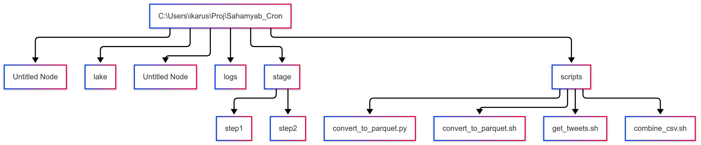

# Sahamyab Tweets ETL Pipeline

## Overview

This project is an **ETL (Extract–Transform–Load) pipeline** for collecting, processing, and storing tweets (short posts) from the Iranian stock market social media platform [Sahamyab](https://www.sahamyab.com/).

The pipeline automatically:

1. Fetches tweets regularly via Sahamyab’s public API.
2. Stores them as CSV files (raw data).
3. Combines CSVs into hourly datasets.
4. Converts CSVs into **Parquet format** for efficient storage and analysis.
5. Stores data in a **data lake** ready for analytics or machine learning.

## Acknowledgment

This project was developed as part of the **Comprehensive Data Engineering Course (7th Cohort)**, taught by **Dr. Mohammad Fozuni**.

The course emphasizes **Rust programming language** and the expansive world of **MLOps**, covering the full lifecycle of data pipelines—from development to deployment on production servers. It also explores the design of **data-driven products using Rust**.

I would like to sincerely thank **Dr. Fozuni** for his guidance and the practical insights provided throughout the course, which made this project possible.

https://www.m-fozouni.ir/

## Features

- **Automated fetching** of tweets using `curl` and `jq`.
- **Scheduled tasks** using Windows Task Scheduler or cron (for WSL/Linux).
- **Data cleaning** and CSV consolidation.
- **Efficient storage** using Apache Parquet.
- **Ready for analysis** with Python, pandas, or Parquet CLI.

------

## Directory Structure



------

## Prerequisites

- Windows 10/11 with **WSL (Ubuntu)** for Bash scripts or Linux environment

- Python 3.x

- Required packages:

  ```bash
  sudo apt-get update
  sudo apt install jq python3 python3-pip curl nano
  pip3 install pandas pyarrow parquet-cli
  ```

------

## Step 1: Fetch Tweets

Create the Bash script `get_tweets.sh`:

```bash
#!/usr/bin/bash
/usr/bin/curl -s -H "User-Agent:Chrome/137.0" https://www.sahamyab.com/guest/twiter/list?v=0.1 | \
/usr/bin/jq '.items[] | [.id, .sendTime, .sendTimePersian, .senderName, .senderUsername, .type, .content] | join(",") ' > /home/ikarus/Proj/Sahamyab_Cron/stage/step1/$(date +%s).csv
```

- Make executable:

  ```bash
  chmod +x get_tweets.sh
  ```

- Schedule with cron (Linux/WSL) or **Windows Task Scheduler** to run every minute.

------

## Step 2: Combine CSV Files

Create `combine_csv.sh`:

```bash
#!/usr/bin/bash
sleep 20
stage1="/home/ikarus/Proj/Sahamyab_Cron/stage/step1"
stage2="/home/ikarus/Proj/Sahamyab_Cron/stage/step2"
fname="$stage2/$(date +%Y-%m-%d-%H).csv"
logfile=/home/ikarus/Proj/Sahamyab_Cron/logs/step2.log

echo "Begin at $(date)" >> $logfile
for i in $(ls $stage1); do
    current="$stage1/$i"
    sed -i "s/\"//g" $current
    cat $current >> $fname
    rm $current
    echo "Processed $i" >> $logfile
done
echo "Successful" >> $logfile
```

- Make executable:

  ```bash
  chmod +x combine_csv.sh
  ```

- Schedule via cron or Windows Task Scheduler.

------

## Step 3: Convert CSV to Parquet

Create `convert_to_parquet.py`:

```python
#!/usr/bin/python3
import pandas as pd
import sys

input_csv = sys.argv[1]
output_dir = sys.argv[2]

df = pd.read_csv(input_csv, header=None, names=['id','sendTime','sendTimePersian', 'senderName', 'senderUsername', 'type', 'content'], dtype={'content': object})
output_file = f"{output_dir}/{input_csv.split('/')[-1].split('.')[0]}.parquet"
df.to_parquet(output_file)
```

Run manually:

```bash
python3 convert_to_parquet.py /home/ikarus/Proj/Sahamyab_Cron/stage/step2/2023-06-05-20.csv /home/ikarus/Proj/Sahamyab_Cron/lake/
```

Create `convert_to_parquet.sh` for automation:

```bash
#!/usr/bin/bash
stage2="/home/ikarus/Proj/Sahamyab_Cron/stage/step2"
lake="/home/ikarus/Proj/Sahamyab_Cron/lake"
logfile="/home/ikarus/Proj/Sahamyab_Cron/logs/step3.log"

echo "Begin at $(date)" >> $logfile
for i in $(ls $stage2); do
    /usr/bin/python3 /home/ikarus/Proj/Sahamyab_Cron/scripts/convert_to_parquet.py $stage2/$i $lake
    echo "Converted $i to Parquet" >> $logfile
done
echo "Successful" >> $logfile
```

- Make executable:

  ```bash
  chmod +x convert_to_parquet.sh
  ```

- Schedule every 2 minutes via cron or Windows Task Scheduler.

------

## Step 4: Preview Parquet Files

Install **Parquet CLI**:

```bash
pip3 install parquet-cli
```

Check first 10 rows:

```bash
parq /home/ikarus/Proj/Sahamyab_Cron/lake/2023-06-05-20.parquet --head 10
```

------

## ETL Pipeline Flowchart (Mermaid)


------

## Notes

- `sys.argv[1]` → input CSV file
- `sys.argv[2]` → output directory
- Unix timestamp (`date +%s`) ensures unique filenames.
- `sed -i "s/\"//g"` removes quotes from CSV content before combining.
- Windows users can run Bash scripts via **WSL** or convert to PowerShell equivalents.

------

## 1️⃣ Open the crontab editor

```
crontab -e
```

- If it asks to choose an editor, select `nano` (simplest).

------

## 2️⃣ Add cron jobs

Assuming your scripts are in:

```
/home/ikarus/Proj/Sahamyab_Cron/scripts/
```

And the folders `stage/step1`, `stage/step2`, `lake/`, and `logs/` exist.

Add these lines to your crontab:

```
# Step 1: Fetch tweets every minute
* * * * * /bin/bash /home/ikarus/Proj/Sahamyab_Cron/scripts/get_tweets.sh

# Step 2: Combine CSVs every minute (adjust sleep if needed)
* * * * * /bin/bash /home/ikarus/Proj/Sahamyab_Cron/scripts/combine_csv.sh

# Step 3: Convert CSV to Parquet every 2 minutes
*/2 * * * * /bin/bash /home/ikarus/Proj/Sahamyab_Cron/scripts/convert_to_parquet.sh
```

------

## 3️⃣ Verify cron jobs

```
crontab -l
```

- You should see all three jobs listed.

------

## 4️⃣ Check logs

Each script writes to a log file:

- `combine_csv.sh` → `/home/ikarus/Proj/Sahamyab_Cron/logs/step2.log`
- `convert_to_parquet.sh` → `/home/ikarus/Proj/Sahamyab_Cron/logs/step3.log`

You can monitor logs with:

```
tail -f /home/ikarus/Proj/Sahamyab_Cron/logs/step2.log
tail -f /home/ikarus/Proj/Sahamyab_Cron/logs/step3.log
```

------

## 5️⃣ Notes

- Use **absolute paths** for scripts and binaries (`/usr/bin/curl`, `/usr/bin/jq`, `/usr/bin/python3`) to avoid “command not found” errors in cron.
- Make sure scripts are **executable**:

```
chmod +x /home/ikarus/Proj/Sahamyab_Cron/scripts/*.sh
chmod +x /home/ikarus/Proj/Sahamyab_Cron/scripts/*.py
```

- Cron runs in a **minimal environment**, so any environment variables (PATH, PYTHONPATH) should be defined in the script or use absolute paths.

## References

- [Sahamyab Official Site](https://www.sahamyab.com/)
- [jq Manual](https://stedolan.github.io/jq/)
- [Parquet Documentation](https://arrow.apache.org/docs/python/parquet.html)

## Extra Note:

You want to **manually check your Bash command** for fetching tweets. Let’s break it down step by step and verify it:

------

### Your command:

```bash
#!/usr/bin/bash
/usr/bin/curl -s -H "User-Agent:Chrome/137.0" https://www.sahamyab.com/guest/twiter/list?v=0.1 | \
/usr/bin/jq '.items[] | [.id, .sendTime, .sendTimePersian, .senderName, .senderUsername, .type, .content] | join(",") ' > /home/ikarus/Proj/Sahamyab_Cron/stage/step1/$(date +%s).csv
```

------

### Step-by-step check:

1. **Check Bash shebang**:

```bash
#!/usr/bin/bash
```

- Make sure `/usr/bin/bash` exists. Usually `/bin/bash` is standard:

```bash
which bash
# should return /bin/bash
```

- If `/usr/bin/bash` doesn’t exist, use `#!/bin/bash`.

------

1. **Check `curl` command**:

```bash
/usr/bin/curl -s -H "User-Agent:Chrome/137.0" https://www.sahamyab.com/guest/twiter/list?v=0.1
```

- `-s` → silent mode (no progress bar).
- `-H "User-Agent:Chrome/137.0"` → sets a browser-like User-Agent (required by Sahamyab API).
- Run it **alone** first to see JSON output:

```bash
/usr/bin/curl -s -H "User-Agent:Chrome/137.0" https://www.sahamyab.com/guest/twiter/list?v=0.1 | jq
```

- If you see the JSON, `curl` is working fine.

------

1. **Check `jq` command**:

```bash
/usr/bin/jq '.items[] | [.id, .sendTime, .sendTimePersian, .senderName, .senderUsername, .type, .content] | join(",")'
```

- This extracts the desired fields and joins them with commas.
- Test `jq` separately with your `curl` output:

```bash
/usr/bin/curl -s -H "User-Agent:Chrome/137.0" https://www.sahamyab.com/guest/twiter/list?v=0.1 | /usr/bin/jq '.items[] | [.id, .sendTime, .sendTimePersian, .senderName, .senderUsername, .type, .content] | join(",")'
```

- You should see CSV-like output in the terminal.

------

1. **Check output path**:

```bash
> /home/ikarus/Proj/Sahamyab_Cron/stage/step1/$(date +%s).csv
```

- Make sure the folder exists:

```bash
ls -lh /home/ikarus/Proj/Sahamyab_Cron/stage/step1/
```

- The filename will be the current Unix timestamp, e.g., `1692638910.csv`.

------

1. **Run manually**:

```bash
/bin/bash
/usr/bin/curl -s -H "User-Agent:Chrome/137.0" https://www.sahamyab.com/guest/twiter/list?v=0.1 | /usr/bin/jq '.items[] | [.id, .sendTime, .sendTimePersian, .senderName, .senderUsername, .type, .content] | join(",") ' > /home/ikarus/Proj/Sahamyab_Cron/stage/step1/$(date +%s).csv
```

- Then check the file:

```bash
ls -lh /home/ikarus/Proj/Sahamyab_Cron/stage/step1/
head -n 5 /home/ikarus/Proj/Sahamyab_Cron/stage/step1/<your_file>.csv
```

------

##  Extra Note:

### 1️⃣ Check the file type

```
file /home/ikarus/Proj/Sahamyab_Cron/scripts/get_tweets.sh
```

- If it says `CRLF line terminators`, you need to convert it.

------

### 2️⃣ Convert to Unix line endings

```
sudo apt-get install dos2unix
dos2unix /home/ikarus/Proj/Sahamyab_Cron/scripts/get_tweets.sh
```

- Do the same for all `.sh` scripts (`combine_csv.sh`, `convert_to_parquet.sh`).

------

### 3️⃣ Remove old files with `\r` in the name

```
cd /home/ikarus/Proj/Sahamyab_Cron/stage/step1
rm *$'\r'
```

- Or rename them if you want to keep:

```
for f in *$'\r'; do mv "$f" "${f//$'\r'/}"; done
```

------

### 4️⃣ Verify

```
ls -lh
```

- Filenames should now be clean: `1755808146.csv`, `1755808562.csv`, etc.

------

✅ **Important:** Always use a Linux-compatible editor (like `nano`, `vim`, or VS Code with LF endings) when creating Bash scripts for WSL/Linux.

## Extra Note:

**Fix for all scripts and logs:**

```
sudo apt install dos2unix

# Fix scripts
dos2unix scripts/*.sh scripts/*.py

# Optional: fix logs (if you want clean output)
dos2unix logs/*.log
```

### 1️⃣ Windows line endings in logs

```
logs/
├── step2.log\015\015
├── step3.log\015\015
```

- `\015` indicates **CR (carriage return)** from Windows line endings.
- This happens if the scripts were created or edited in Windows.
- It can also break cron parsing or logging.

**Fix for all scripts and logs:**

------

### 2️⃣ `stage/step2` is empty

```
stage/
└── step2
```

- This explains why your “combined CSVs” aren’t appearing.
- Likely causes:
  1. `combine_csv.sh` didn’t run properly (probably because of CRLF or unsafe `for` loop).
  2. `step2` folder existed but no files got concatenated.

**Fix:** Use a safer combine loop:

```
#!/usr/bin/bash
sleep 20

stage1="/home/ikarus/Proj/Sahamyab_Cron/stage/step1"
stage2="/home/ikarus/Proj/Sahamyab_Cron/stage/step2"
mkdir -p "$stage2"

fname="$stage2/$(date +%Y-%m-%d-%H).csv"
logfile=/home/ikarus/Proj/Sahamyab_Cron/logs/step2.log

echo "Begin at $(date)" >> "$logfile"

for current in "$stage1"/*; do
    [ -f "$current" ] || continue
    dos2unix "$current" 2>/dev/null
    sed -i 's/"//g' "$current"
    cat "$current" >> "$fname"
    rm "$current"
    echo "Processed $(basename "$current")" >> "$logfile"
done

echo "Successful" >> "$logfile"
```

------

### 3️⃣ Next step: Parquet conversion

- After `step2` CSVs exist, your `convert_to_parquet.sh` can run.
- Make sure the script points to **existing CSVs in `stage/step2`**.

------

### 4️⃣ Verify manually

```
# Check step1 files
ls -lh stage/step1

# Check step2 combined CSV
ls -lh stage/step2

# Check logs
cat logs/step2.log
```

**Fix for all scripts and logs:**

```
sudo apt install dos2unix

# Fix scripts
dos2unix scripts/*.sh scripts/*.py

# Optional: fix logs (if you want clean output)
dos2unix logs/*.log
```

------

------

✅ **Summary**

1. Convert all scripts to Unix line endings (`dos2unix`).
2. Fix `combine_csv.sh` using safe for-loop and create `step2` folder.
3. Remove old `$'\r'` characters from filenames if necessary.
4. After this, cron jobs for Step 1, 2, 3 should work properly.

---
config:
  layout: dagre
  theme: neo
---
flowchart LR
    A["🌐 API"] --> B["📝 Fetch Tweets"]
    B --> C["📂 Combine CSVs"]
    C --> D["🛠 Convert to Parquet"]
    D --> E["🏞 Store in Data Lake"]
    E --> F["🧹 Data Cleaning"]
    F --> G["📊 Feature Engineering"]
    G --> H["🌐 NLP & Translation"]
    H --> I["💾 Data Warehouse"]
    I --> J["📈 Analysis & Visualization"]
    J --> K["📊 Dashboard"]

```


